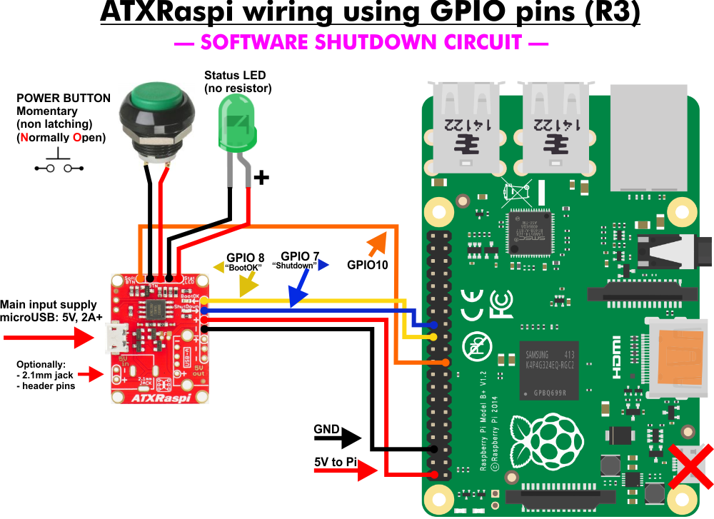

# Raspberry con ATXRaspi
Installazione e configurazione del modulo ATXRaspi per Raspberry.
ATXRaspi è un controller di alimentazione intelligente versatile per RaspberryPi. Consente di spegnere o riavviare il tuo Pi premendo un pulsante, senza bisogno di accedere per eseguire quei comandi tramite la console/ssh. Inoltre, interromperà completamente l'alimentazione al Pi in caso di spegnimento.
L'ultima revisione di ATXRaspi (R3) permette di configurare vari parametri funzionali e di comportamento.
È possibile utilizzare ATXRaspi con:
- pulsanti momentanei o interruttori a scatto
- con o senza led
- gestione software delle procedure di riavvio e/o spegnimento

# Requisiti
1. Raspberry con sistema operativo giá installato e configurato. Seguire la [guida](https://github.com/ginocic/Preparazione-Raspberry)
2. (Facoltativo) Installare un display oled per alcune informazioni del sistema. Seguire la [guida](https://github.com/ginocic/RaspberryPi-Display-OLED)
3. (Facoltativo) Spostare il rootfs su disco SSD e attivazione del servizio TRIM. Seguire la [guida](https://gist.github.com/ginocic/3322d84c035f09ca956418c88c8f9b43)
4. ATXRaspi. [Informazioni e guida](https://lowpowerlab.com/guide/atxraspi/?view=all) e [acquisto](https://lowpowerlab.com/shop/product/91)

# Premessa
Qui viene eseguita l'assemblaggio, installazione e configurazione del Modulo ATXRaspi con le seguenti caratteristiche:
- pulsante momentaneo con led
- spegnimento completo da software

Per ulteriori modalitá e/o caratteristiche, fare riferimento alla [guida ufficiale](https://lowpowerlab.com/guide/atxraspi/?view=all) dal sito ufficiale.

# Assemblaggio e Installazione
## Fase 1 - Connessione al Raspberry
Seguire la foto seguente per le connessioni tra il Raspberry e l'ATXRaspi:



## Fase 2 - Installazione dello script necessario
```bash
sudo wget https://raw.githubusercontent.com/LowPowerLab/ATX-Raspi/master/shutdownchecksetup.sh
sudo bash shutdownchecksetup.sh
sudo rm shutdownchecksetup.sh
sudo reboot
```

Questi comandi installeranno uno script bash (`/etc/shutdowncheck`) che sará eseguito al termine del processo di boot aggiungendo una linea a `/etc/rc.local`. Una volta riavviato il Raspberry, lo script dovrebbe partire e dovrebbe mostrare il messaggio (se il sistema non avvia una sessione grafica):

```
ATXRaspi shutdowncheck script started: asserted pins (7=input,LOW; 8=output,HIGH). Waiting for GPIO7 to become HIGH…
```

Questo indica che lo script è in esecuzione e attende un segnale di spegnimento dall'ATXRaspi.
Si dovrebbe essere in grado di avviare, riavviare e spegnere il Raspberry dal pulsante d'alimentazione.

## Fase 3 - Spegnimento completo da software
> **Nota**: Lo spegnimento da software funziona **SOLTANTO** con il pulsante momentaneo. **NON FUNZIONA** con interruttori o pulsanti a scatto!!!

Avendo seguito lo schema delle connessioni dalla foto precedente, la parte hardware è giá pronta.
Creare lo script da lanciare quando si vorrá spegnere o riavviare

```bash
sudo nano /usr/local/bin/softshutdown.sh
```

Copiare nel file appena creato il codice seguente
```
#!/bin/bash
BUTTON=10

#setup GPIO 10 as output and set to HIGH
echo "$BUTTON" > /sys/class/gpio/export;
echo "out" > /sys/class/gpio/gpio$BUTTON/direction
echo "1" > /sys/class/gpio/gpio$BUTTON/value

#keep GPIO 10 high for at least 4 seconds for shutdown, 1s for reboot (same as pressing ATXRaspi button)
SLEEP=${1:-4} #default to 4 seconds if no delay value was passed

re='^[0-9\.]+$'
if ! [[ $SLEEP =~ $re ]] ; then
   echo "error: sleep time not a number" >&2; exit 1
fi

echo "ATXRaspi button press for: $SLEEP seconds..."
/bin/sleep $SLEEP

#restore GPIO 10
echo "0" > /sys/class/gpio/gpio$BUTTON/value
```

Rendere il file eseguibile
```bash
sudo chmod +x softshutdown.sh
```

Verificare che i permessi del file siano corretti
```bash
cd /usr/local/bin
ls -la softshutdown.sh
```
il risultato di questi comandi dovrebbere essere qualcosa del genere:
```
pi@raspberry:/usr/local/bin $ ls -la softshutdown.sh
-rwxr-xr-x  1 root staff  580 Dec 29 17:59 softshutdown.sh
```
